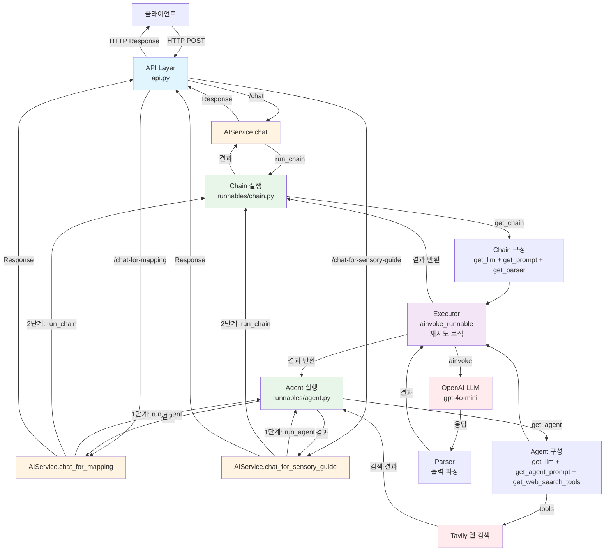
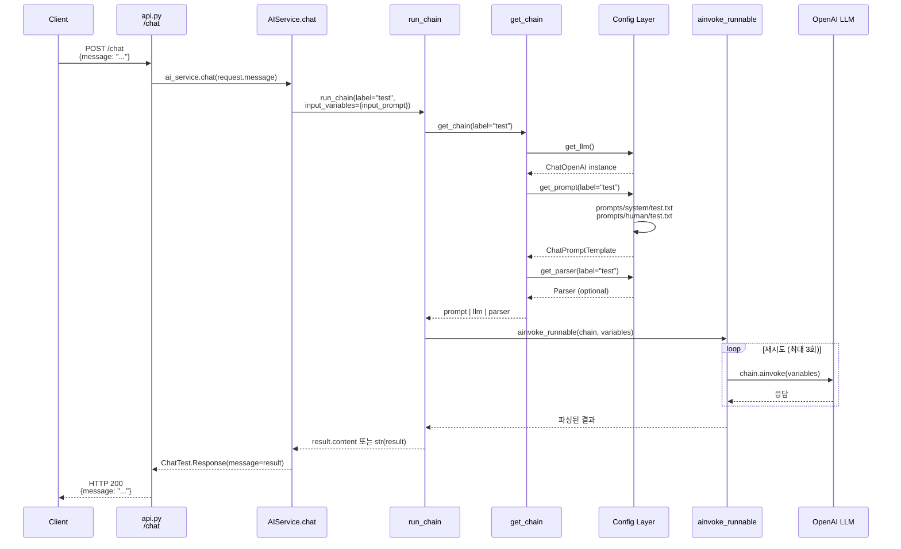
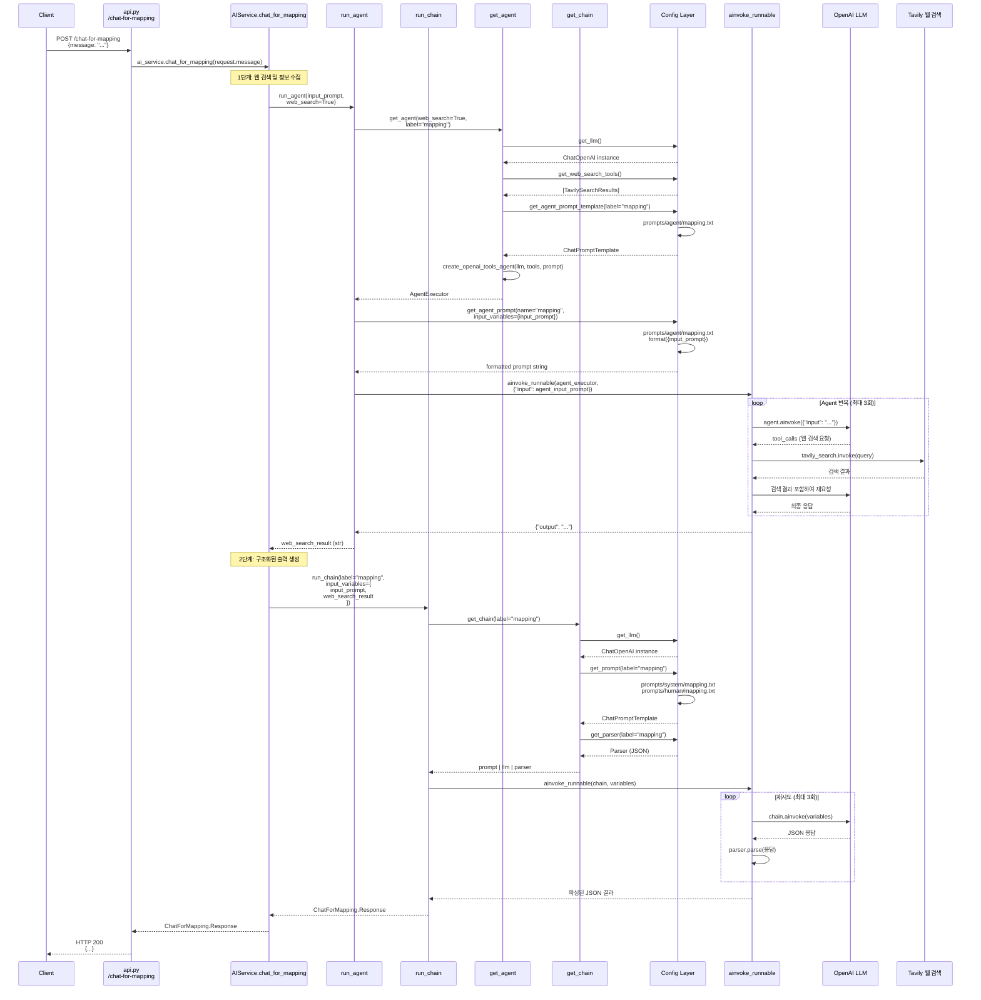
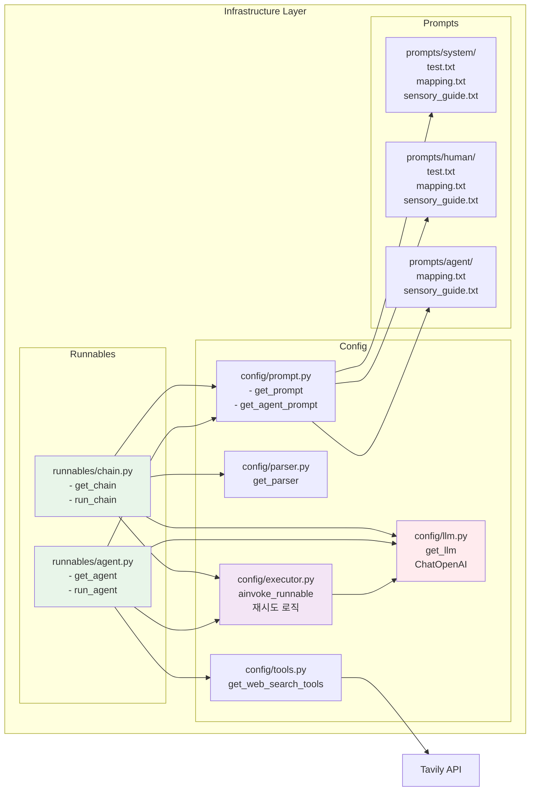
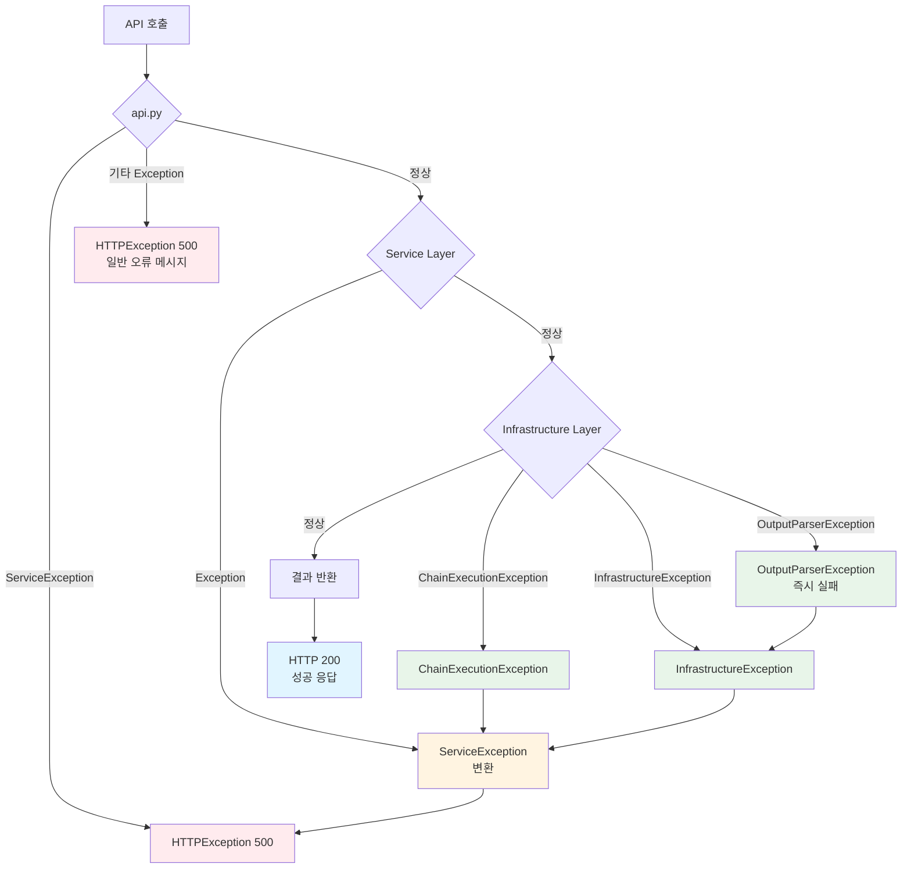

# API 호출 흐름도

## 전체 시스템 아키텍처

```mermaid
graph TB
    Client[클라이언트] -->|HTTP POST| API[API Layer<br/>api.py]
    
    API -->|/chat| Service1[AIService.chat]
    API -->|/chat-for-mapping| Service2[AIService.chat_for_mapping]
    API -->|/chat-for-sensory-guide| Service3[AIService.chat_for_sensory_guide]
    
    Service1 -->|run_chain| Chain[Chain 실행<br/>runnables/chain.py]
    Service2 -->|1단계: run_agent| Agent[Agent 실행<br/>runnables/agent.py]
    Service2 -->|2단계: run_chain| Chain
    Service3 -->|1단계: run_agent| Agent
    Service3 -->|2단계: run_chain| Chain
    
    Chain -->|get_chain| ChainConfig[Chain 구성<br/>get_llm + get_prompt + get_parser]
    Agent -->|get_agent| AgentConfig[Agent 구성<br/>get_llm + get_agent_prompt + get_web_search_tools]
    
    ChainConfig --> Executor[Executor<br/>ainvoke_runnable<br/>재시도 로직]
    AgentConfig --> Executor
    
    Executor -->|ainvoke| LLM[OpenAI LLM<br/>gpt-4o-mini]
    AgentConfig -->|tools| WebSearch[Tavily 웹 검색]
    
    LLM -->|응답| Parser[Parser<br/>출력 파싱]
    Parser -->|결과| Executor
    WebSearch -->|검색 결과| Agent
    
    Executor -->|결과 반환| Chain
    Executor -->|결과 반환| Agent
    
    Chain -->|결과| Service1
    Agent -->|결과| Service2
    Agent -->|결과| Service3
    
    Service1 -->|Response| API
    Service2 -->|Response| API
    Service3 -->|Response| API
    
    API -->|HTTP Response| Client
    
    style API fill:#e1f5ff
    style Service1 fill:#fff4e1
    style Service2 fill:#fff4e1
    style Service3 fill:#fff4e1
    style Chain fill:#e8f5e9
    style Agent fill:#e8f5e9
    style Executor fill:#f3e5f5
    style LLM fill:#ffebee
    style WebSearch fill:#ffebee
```

## 상세 흐름: /chat 엔드포인트

```mermaid
sequenceDiagram
    participant Client
    participant API as api.py<br/>/chat
    participant Service as AIService.chat
    participant Chain as run_chain
    participant GetChain as get_chain
    participant Config as Config Layer
    participant Executor as ainvoke_runnable
    participant LLM as OpenAI LLM
    
    Client->>API: POST /chat<br/>{message: "..."}
    API->>Service: ai_service.chat(request.message)
    
    Service->>Chain: run_chain(label="test",<br/>input_variables={input_prompt})
    
    Chain->>GetChain: get_chain(label="test")
    GetChain->>Config: get_llm()
    Config-->>GetChain: ChatOpenAI instance
    GetChain->>Config: get_prompt(label="test")
    Config->>Config: prompts/system/test.txt<br/>prompts/human/test.txt
    Config-->>GetChain: ChatPromptTemplate
    GetChain->>Config: get_parser(label="test")
    Config-->>GetChain: Parser (optional)
    GetChain-->>Chain: prompt | llm | parser
    
    Chain->>Executor: ainvoke_runnable(chain, variables)
    
    loop 재시도 (최대 3회)
        Executor->>LLM: chain.ainvoke(variables)
        LLM-->>Executor: 응답
    end
    
    Executor-->>Chain: 파싱된 결과
    Chain-->>Service: result.content 또는 str(result)
    Service-->>API: ChatTest.Response(message=result)
    API-->>Client: HTTP 200<br/>{message: "..."}
```

## 상세 흐름: /chat-for-mapping 엔드포인트

```mermaid
sequenceDiagram
    participant Client
    participant API as api.py<br/>/chat-for-mapping
    participant Service as AIService.chat_for_mapping
    participant Agent as run_agent
    participant Chain as run_chain
    participant GetAgent as get_agent
    participant GetChain as get_chain
    participant Config as Config Layer
    participant Executor as ainvoke_runnable
    participant LLM as OpenAI LLM
    participant WebSearch as Tavily 웹 검색
    
    Client->>API: POST /chat-for-mapping<br/>{message: "..."}
    API->>Service: ai_service.chat_for_mapping(request.message)
    
    Note over Service: 1단계: 웹 검색 및 정보 수집
    
    Service->>Agent: run_agent(input_prompt,<br/>web_search=True)
    
    Agent->>GetAgent: get_agent(web_search=True,<br/>label="mapping")
    GetAgent->>Config: get_llm()
    Config-->>GetAgent: ChatOpenAI instance
    GetAgent->>Config: get_web_search_tools()
    Config-->>GetAgent: [TavilySearchResults]
    GetAgent->>Config: get_agent_prompt_template(label="mapping")
    Config->>Config: prompts/agent/mapping.txt
    Config-->>GetAgent: ChatPromptTemplate
    GetAgent->>GetAgent: create_openai_tools_agent(llm, tools, prompt)
    GetAgent-->>Agent: AgentExecutor
    
    Agent->>Config: get_agent_prompt(name="mapping",<br/>input_variables={input_prompt})
    Config->>Config: prompts/agent/mapping.txt<br/>format({input_prompt})
    Config-->>Agent: formatted prompt string
    
    Agent->>Executor: ainvoke_runnable(agent_executor,<br/>{"input": agent_input_prompt})
    
    loop Agent 반복 (최대 3회)
        Executor->>LLM: agent.ainvoke({"input": "..."})
        LLM-->>Executor: tool_calls (웹 검색 요청)
        Executor->>WebSearch: tavily_search.invoke(query)
        WebSearch-->>Executor: 검색 결과
        Executor->>LLM: 검색 결과 포함하여 재요청
        LLM-->>Executor: 최종 응답
    end
    
    Executor-->>Agent: {"output": "..."}
    Agent-->>Service: web_search_result (str)
    
    Note over Service: 2단계: 구조화된 출력 생성
    
    Service->>Chain: run_chain(label="mapping",<br/>input_variables={<br/>  input_prompt,<br/>  web_search_result<br/>})
    
    Chain->>GetChain: get_chain(label="mapping")
    GetChain->>Config: get_llm()
    Config-->>GetChain: ChatOpenAI instance
    GetChain->>Config: get_prompt(label="mapping")
    Config->>Config: prompts/system/mapping.txt<br/>prompts/human/mapping.txt
    Config-->>GetChain: ChatPromptTemplate
    GetChain->>Config: get_parser(label="mapping")
    Config-->>GetChain: Parser (JSON)
    GetChain-->>Chain: prompt | llm | parser
    
    Chain->>Executor: ainvoke_runnable(chain, variables)
    
    loop 재시도 (최대 3회)
        Executor->>LLM: chain.ainvoke(variables)
        LLM-->>Executor: JSON 응답
        Executor->>Executor: parser.parse(응답)
    end
    
    Executor-->>Chain: 파싱된 JSON 결과
    Chain-->>Service: ChatForMapping.Response
    Service-->>API: ChatForMapping.Response
    API-->>Client: HTTP 200<br/>{...}
```

## Infrastructure 레이어 상세 구조

```mermaid
graph LR
    subgraph "Infrastructure Layer"
        subgraph "Runnables"
            Chain[runnables/chain.py<br/>- get_chain<br/>- run_chain]
            Agent[runnables/agent.py<br/>- get_agent<br/>- run_agent]
        end
        
        subgraph "Config"
            LLM[config/llm.py<br/>get_llm<br/>ChatOpenAI]
            Prompt[config/prompt.py<br/>- get_prompt<br/>- get_agent_prompt]
            Parser[config/parser.py<br/>get_parser]
            Tools[config/tools.py<br/>get_web_search_tools]
            Executor[config/executor.py<br/>ainvoke_runnable<br/>재시도 로직]
        end
        
        subgraph "Prompts"
            SystemPrompts[prompts/system/<br/>test.txt<br/>mapping.txt<br/>sensory_guide.txt]
            HumanPrompts[prompts/human/<br/>test.txt<br/>mapping.txt<br/>sensory_guide.txt]
            AgentPrompts[prompts/agent/<br/>mapping.txt<br/>sensory_guide.txt]
        end
    end
    
    Chain --> LLM
    Chain --> Prompt
    Chain --> Parser
    Chain --> Executor
    
    Agent --> LLM
    Agent --> Prompt
    Agent --> Tools
    Agent --> Executor
    
    Prompt --> SystemPrompts
    Prompt --> HumanPrompts
    Prompt --> AgentPrompts
    
    Executor --> LLM
    Tools --> WebSearch[Tavily API]
    
    style Chain fill:#e8f5e9
    style Agent fill:#e8f5e9
    style Executor fill:#f3e5f5
    style LLM fill:#ffebee
```

## 예외 처리 흐름

```mermaid
graph TD
    Start[API 호출] --> API{api.py}
    
    API -->|정상| Service{Service Layer}
    API -->|ServiceException| HTTP500[HTTPException 500]
    API -->|기타 Exception| HTTP500Generic[HTTPException 500<br/>일반 오류 메시지]
    
    Service -->|정상| Infra{Infrastructure Layer}
    Service -->|Exception| ServiceException[ServiceException<br/>변환]
    
    Infra -->|정상| Result[결과 반환]
    Infra -->|ChainExecutionException| ChainError[ChainExecutionException]
    Infra -->|InfrastructureException| InfraError[InfrastructureException]
    Infra -->|OutputParserException| ParseError[OutputParserException<br/>즉시 실패]
    
    ChainError --> ServiceException
    InfraError --> ServiceException
    ParseError --> InfraError
    
    ServiceException --> HTTP500
    Result --> Success[HTTP 200<br/>성공 응답]
    
    style HTTP500 fill:#ffebee
    style HTTP500Generic fill:#ffebee
    style ServiceException fill:#fff4e1
    style ChainError fill:#e8f5e9
    style InfraError fill:#e8f5e9
    style ParseError fill:#e8f5e9
    style Success fill:#e1f5ff
```
